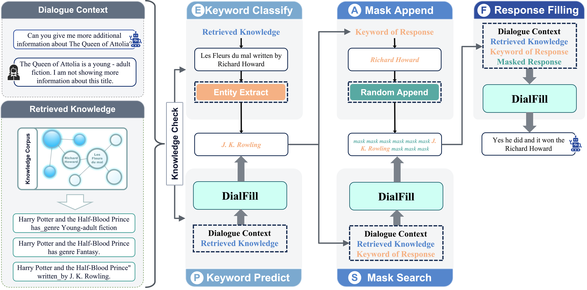
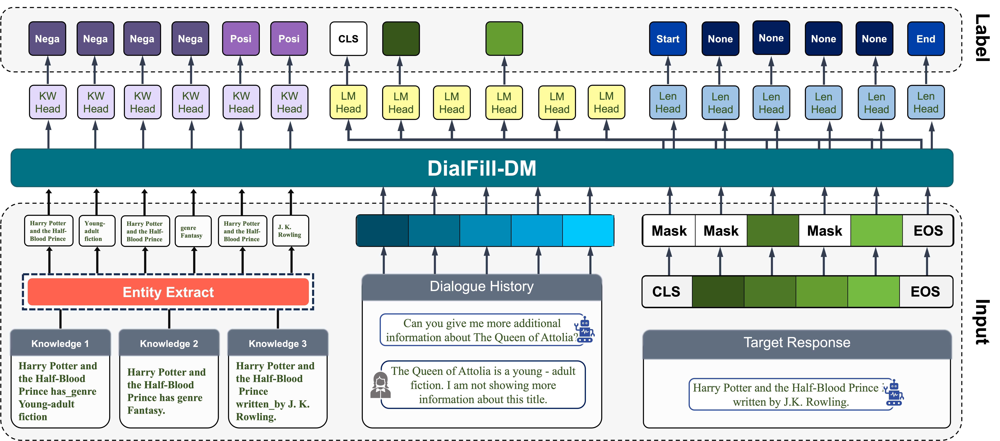

  

 

### 👨‍🔬 About Me

I am a Ph.D. researcher in **Conversational AI** at **Kobe University**.  
My work focuses on **dialogue systems**, especially **knowledge-grounded response generation** and the **DialFill framework** for reliably using retrieved information in open-domain dialogue. I am interested in building dialogue agents that can:

- faithfully use external knowledge instead of hallucinating,
- flexibly paraphrase rather than copy,
- and avoid generic, repetitive responses.

* 🎓 Ph.D. Candidate at **Kobe University**
* 🔍 Research topics: `Dialogue Systems`, `Knowledge-Grounded Dialogue`, `Retrieval-Augmented Generation`, `Dialogue Filling (DialFill)`, `Diffusion Language Models`, `Generative–Classification LMs`
* 🧪 Currently working on: `DialFill Framework (v1–v3)`, `DialFill-DM`, `JudgerToken-based repetition control`
* 📫 Contact: **xueqiang199305@gmail.com**

 

---

### 🔬 Selected Projects & Publications

| **Project Visual** | **Description & Contributions** |
| :---: | :--- |
|  | **DialFill: Dialogue Filling for Knowledge-Grounded Dialogue**  • **IEEE Access, 2025** • Reframes knowledge-grounded dialogue as a **Dialogue Filling** task instead of direct generation. • Ensures that selected knowledge appears in the final response while keeping the wording natural. • **Benchmarks:** Wizard-of-Wikipedia, OpenDialKG.    |
|  | **DialFill-DM: Diffusion Models for Controllable Dialogue**  • **Preprint / Under Review** • Replaces the autoregressive generator with a **masked diffusion language model** for more controllable answer spans. • Introduces a **length head** (to locate the answer region) and a **keyword head** (to control entity copying). • Improves robustness to noisy retrieval.     |

 

#### 🧵 More Research Highlights

- **Dialogue-Filling in Retrieval–Generation Systems**  
  Developed text-infilling based response control for retrieval–generation dialogue systems, ensuring that retrieved responses are actually used instead of ignored.

- **JudgerToken: Single-Token Repetition Control**  
  Proposed a **single-token generative–classification method** (JudgerToken) that uses the LM’s own logits to detect and suppress repetitive or low-quality responses without extra classifiers.

- **Knowledge Graph Memory for Dialogue**  
  Explored how to store and reuse knowledge-graph information inside dialogue models to improve consistency across turns.

 

---

### 🛠️ Tech Stack

  
  
  
  
  

 

  

